# README: 

# Portfolio Site (Profile Website) — React + TypeScript + Tailwind + AWS (S3 + CloudFront + Route 53)


# Overview

### This repository is my personal profile/portfolio website built as a **real end-to-end product deliverable**:
- **Front end**: React + TypeScript + TailwindCSS (clean UI, responsive layout, data-driven sections)
- **Hosting**: AWS S3 (private origin) + CloudFront (CDN + HTTPS) with **Origin Access Control (OAC)**
- **Domain**: Route 53 + ACM (TLS) for `jasonweimarstack1.com` + `www`


# What this demonstrates

### Engineering behaviors
- **Product-minded UI**: consistent spacing rhythm, typography hierarchy, clean components
- **Evidence-first workflow**: screenshots prove each milestone (local setup → UI polish → AWS hosting + TLS)
- **Infrastructure security**: private S3 origin with OAC (no public bucket website)
- **CDN and caching awareness**: HTML vs hashed assets; invalidation strategy
- **Operational repeatability**: deploy script and environment variables to reduce human error

### Front-end competency signals
- Data-driven rendering (projects/tiles sourced from typed config files)
- Reusable UI primitives (`Container`, `Section`, `Card`, `Button`) with consistent styling
- Responsive layout behavior (mobile-first verification)

### AWS competency signals
- Correct CloudFront + ACM pattern (cert in `us-east-1`)
- Correct DNS pattern (Route 53 alias records)
- Correct SPA routing pattern (CloudFront error response fallback)
- Deploy automation: build → S3 sync (cache headers) → CloudFront invalidation


# Services used
- **Amazon S3** — private origin storing static build artifacts (`dist/`)
- **Amazon CloudFront** — CDN, HTTPS, caching, SPA routing behavior
- **CloudFront OAC (Origin Access Control)** — restricts S3 access to CloudFront only
- **AWS Certificate Manager (ACM)** — public certificate for apex + www (**issued in `us-east-1` for CloudFront**)
- **Amazon Route 53** — DNS (A/AAAA alias records to CloudFront)


# Architecture
**Runtime flow**

Browser → CloudFront (CDN + TLS) → (OAC) → S3 (private bucket, static assets)


**Client routing**

- Single-page app (SPA) routing handled by CloudFront custom error responses:
  - `403/404 → /index.html → 200` so deep links work


# Repo structure

/src
/components
/layout (Container, Section)
/ui (Card, Button)
/data (siteConfig, projects, proofTiles)
/sections (FeaturedProjects, ProofTiles, Now, AboutThisSite)
/scripts
env.sh
deploy.sh
/docs/screenshots


# Local development

**Prereqs**
- Node.js (Vite/React build)
- npm

### Run locally
```bash
npm install
npm run dev
```
### Build artifact

```bash
npm run build
```

**Output goes to:**

**dist/** (this is the deploy artifact uploaded to S3)

___

# Deployment (AWS)

**Environment variables (recommended)**

This project uses a dedicated AWS CLI profile and env vars to avoid repetitive typing and reduce mistakes.

### Load env vars:
```bash
source scripts/env.sh
```

### Deploy end-to-end:

```bash
./scripts/deploy.sh
```

## Deploy workflow mechanics

1) Build site: npm run build → produces dist/

2) Upload non-HTML assets with long cache headers (hashed assets)

3) Upload HTML with no-cache headers (ensures entry page updates)

4) Invalidate CloudFront (/*) to force edge refresh

___

## Screenshot Index

**All screenshots live in: `docs/screenshots/`**

## Step A — Local baseline

### 01 — Local Dev Server Running
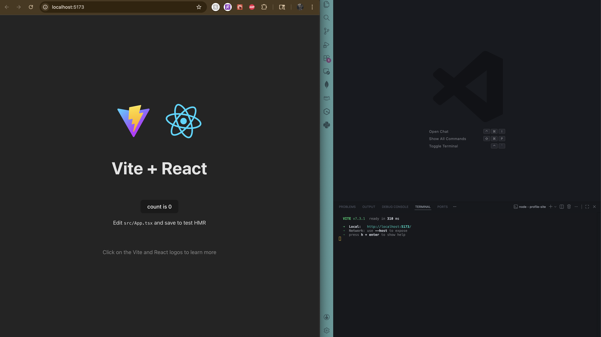

### 02 — TailwindCSS Verified Working
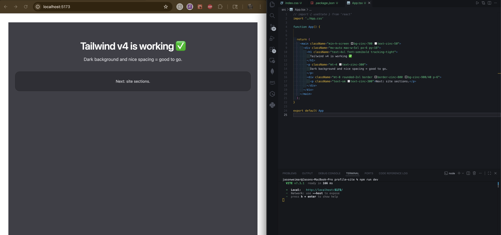

## Step B — Design spine + layout

### 03 — Hero Layout (Initial Scaffold)
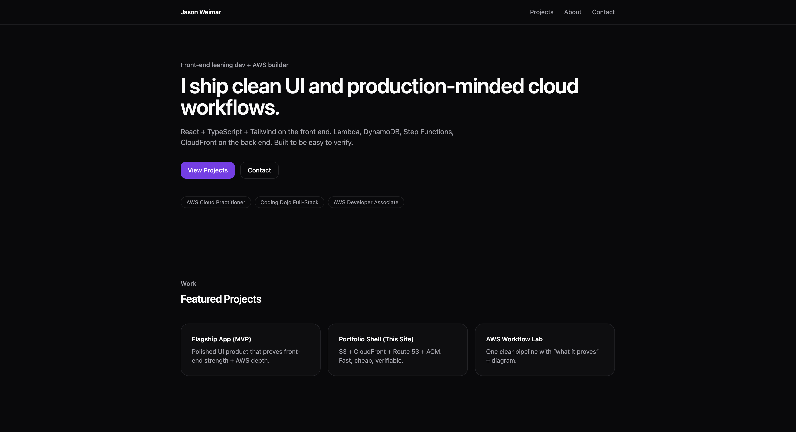

### 04 — Project Cards Layout (Design Spine)
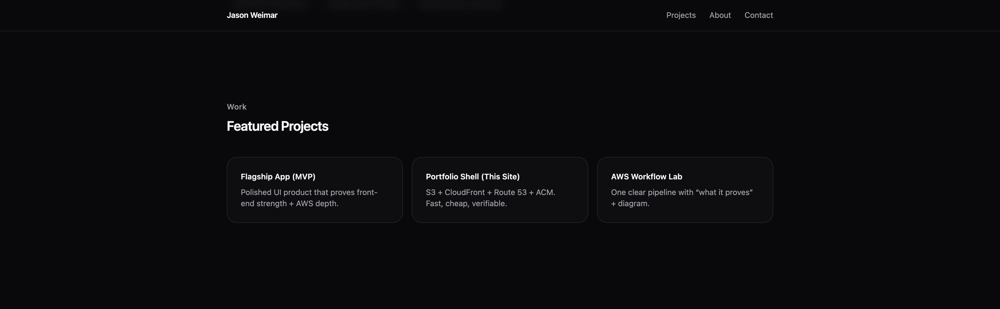

### 05 — Mobile Layout Verification
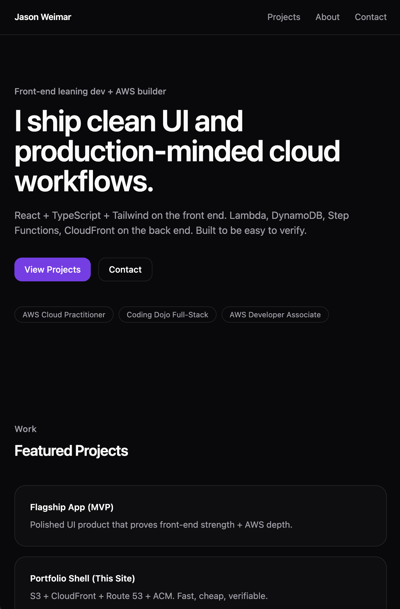

## Step C — Data-driven sections

### 06 — Featured Projects Rendering from Data
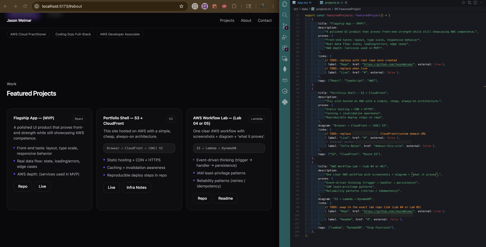

### 07 — Proof Tiles Section


### 08 — “About This Website” Section (Initial)
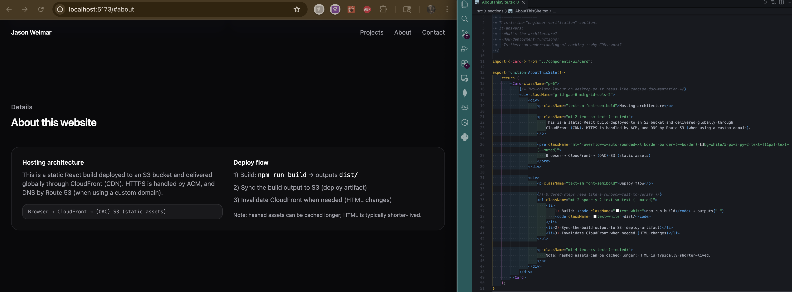

## Step E — Polished story sections

### 09 — Hero Section (Final Copy + CTAs)
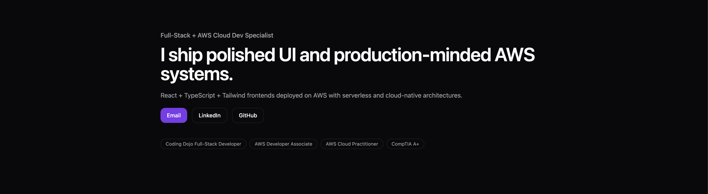

### 10 — Bio / About Section (Paragraph Layout)
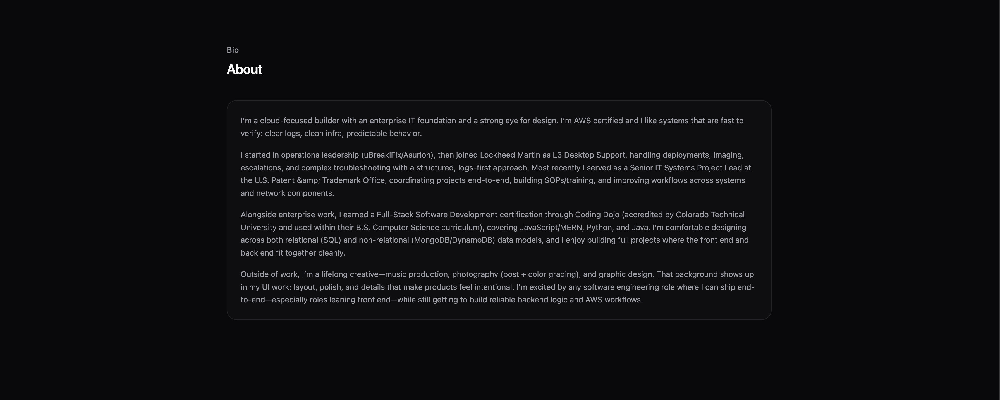

### 11 — “Now” Section (Current Focus)
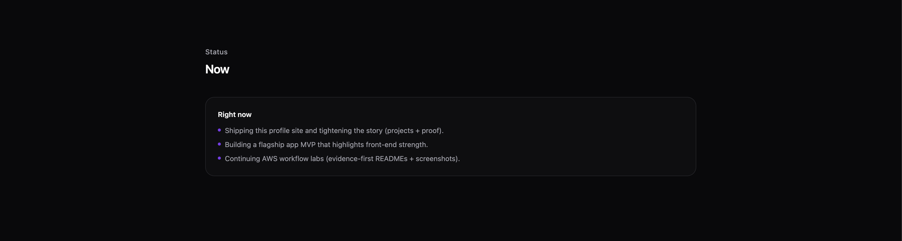

### 12 — Featured Projects Section (Final)
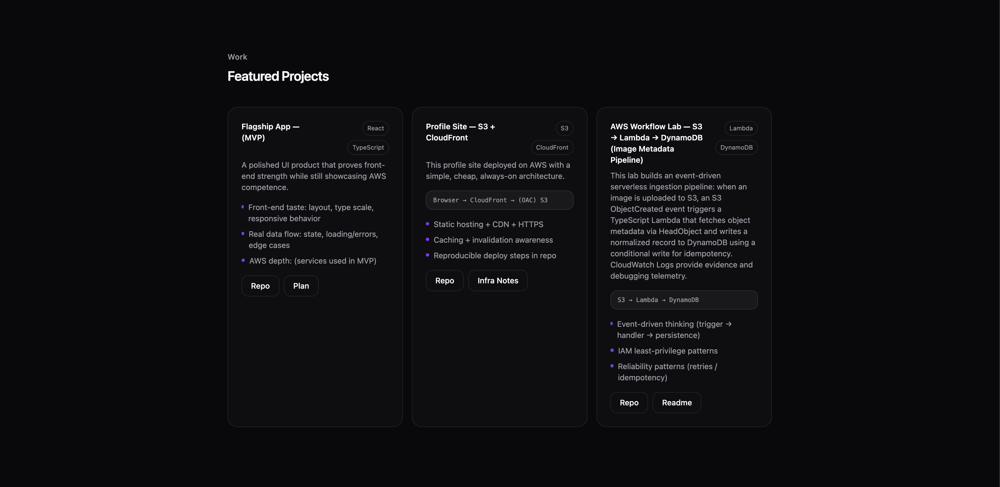

### 13 — Contact / Social Section


## Step F — AWS hosting + custom domain

### 14 — S3 Bucket Origin (Private)
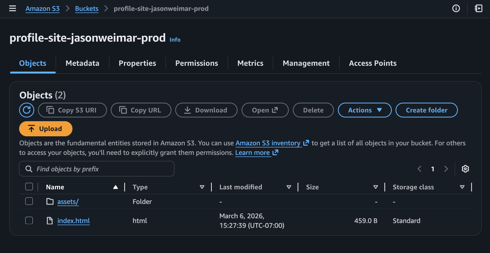

### 15 — CloudFront Distribution + Custom Domain Certificate**
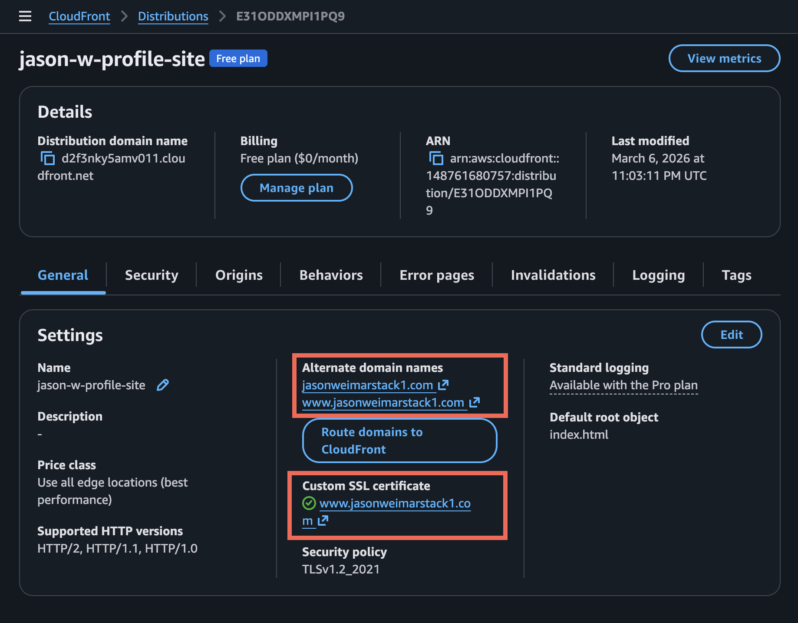

### 16 — CloudFront Origin Access Control (OAC)**
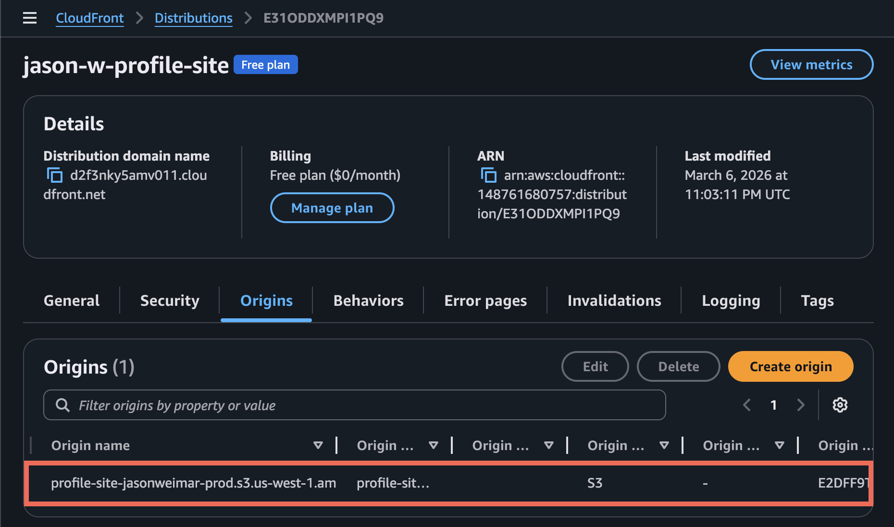

### 17 — CloudFront SPA Routing (403/404 → /index.html)
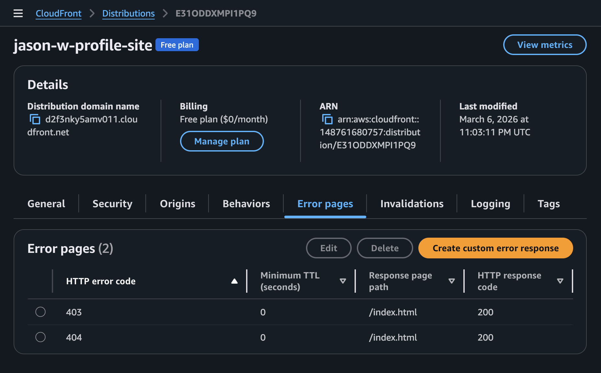

### 18 — Live Site Loaded via CloudFront
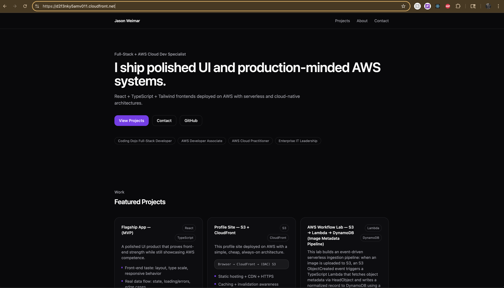

### 19 — Deploy Script Run (CLI Proof)
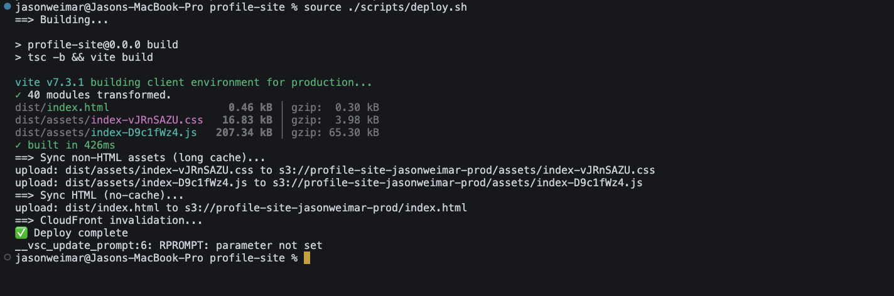

### 20 — ACM Certificate Issued (Apex + WWW)
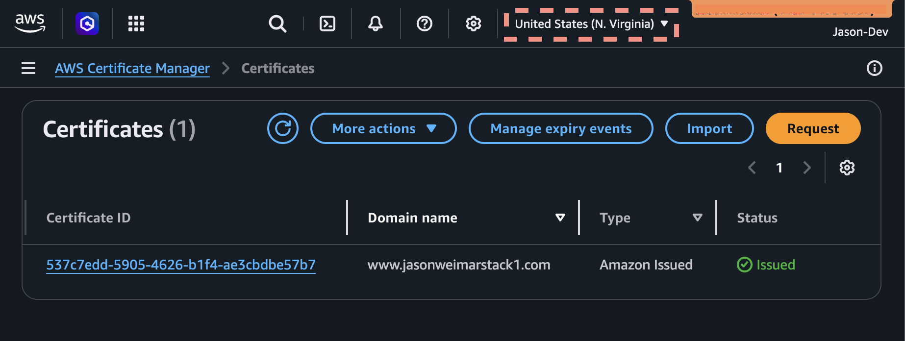

### 21 — Route 53 Alias Records (Apex + WWW → CloudFront)
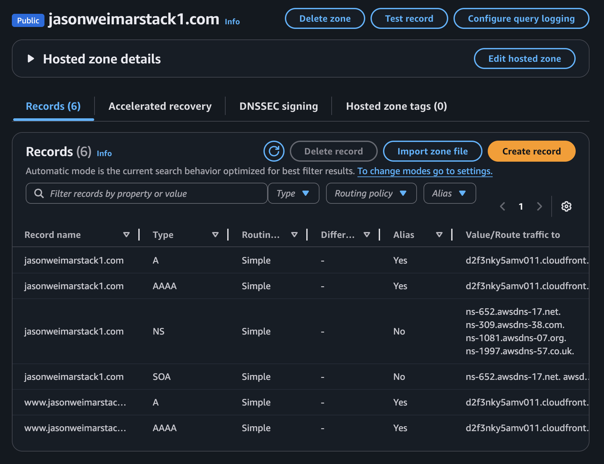

### 22 — HTTPS Certificate Proof in Browser
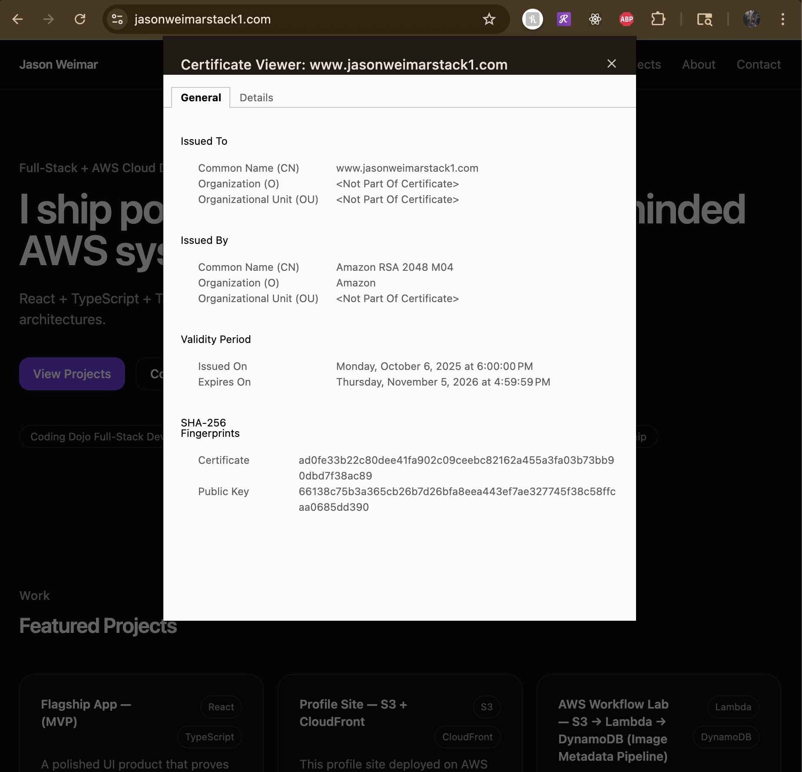

# IAM / Security Flow (how access works)

**Goal: keep the origin private and make CloudFront the only public entry point.**

1) You (CLI user / SSO session) run deploy commands

2) S3 bucket blocks public access

3) CloudFront uses OAC to fetch objects from S3

4) Bucket policy permits reads only from the CloudFront distribution (via OAC)

5) Route 53 routes the domain to CloudFront

6) ACM provides TLS for apex + www (CloudFront requires ACM certs in us-east-1)

## Cost control

**This architecture is designed to stay up full-time at low cost:**

- S3 storage is minimal (static assets)

- CloudFront costs scale with traffic

- Route 53 hosted zone is a small fixed monthly cost

- ACM certificates are free for CloudFront

## Notes / Future improvements

- Add a lightweight CI/CD pipeline (GitHub Actions → build → S3 sync → invalidation)

- Add a CloudFront Function to redirect www → apex (or vice versa) for canonical URLs

- Add a small “Design / UI experiments” page only if it remains low-scope